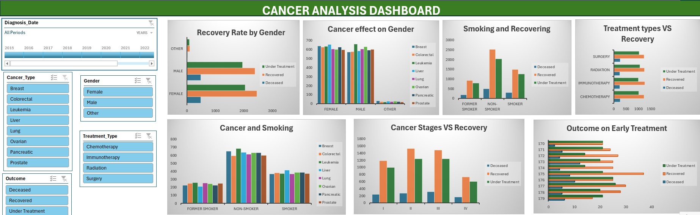

# Project 1

**Title:** [CANCER ANALYSIS DASHBOARD](https://github.com/MariaTemitope/.github.io/blob/main/CANCER%20ANALYSIS%20DASHBOARD.xlsx)

**Tools Used:** Microsoft Excel, Pivot chart, Pivot Table, Conditional Formatting, Sort tool, Interactive Slicer and Timeline.

**Project Description:** This project involves analysing a cancer dataset to identify gender differences in cancer recovery, assess smoking’s impact on outcomes, and identify effective treatments. 
This dashboard is designed to allow stakeholders to easily highlight the importance of early diagnosis and intervention, supporting targeted care strategies to improve survival rates and treatment success across various cancer types and stages. The dashboard includes the following insights:
Recovery Rate by Gender: Compares differences in recovery outcomes between male and female patients.
Cancer Effect on Gender: Shows the impact of cancer cases on different genders
Smoking and Recovering: Compares recovery rates between smokers and non-smokers.
Treatment Types vs Recovery: Evaluates recovery success rates across different treatment types (e.g, surgery, chemo, radiation).
Cancer and Smoking: Analyse the relationship between smoking and cancer occurrence.
Cancer Stages vs Recovery: Shows the relationship between stages of cancer and the likelihood of recovery. 
Outcome on Early Treatment: Compares patient recovery outcomes based on how early treatment began. 
In addition, the following interactive slicers and timeline were also employed.
Slicers:
•	Cancer Types: Enables focus on specific cancer type (e.g., lung, breast, colon).
•	Treatment Types: Helps compare outcomes of specific medical interventions.
•	Outcomes: Filters data by patients who are deceased, recovered, or under treatment.
•	Gender: Analyse trends and outcomes across male/female patients.
Timeline: Track yearly changes, trends and progress over time.

**Key findings:** Advanced cancer stages are related to lower survival rates, emphasising the significance of early detection and care.
Different forms of cancer respond differently to therapies, emphasising the importance of tailored medicine.
Gender influences cancer diagnosis and survival, highlighting health disparities that must be addressed. 

**Dashboard Overview:** 

